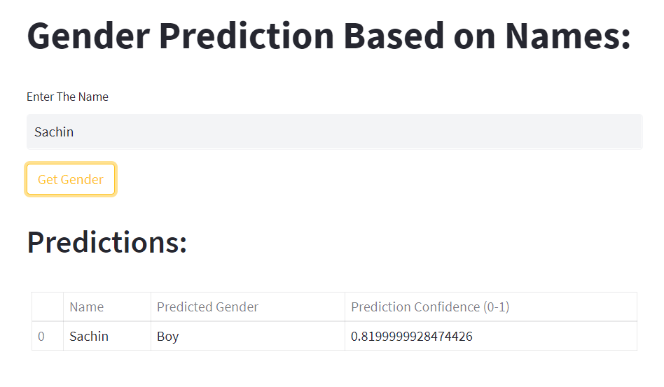

# Gender prediction based on Name LSTM
This ipython notebook is working to build a model which will predict the gender based on the names. 
The dataset used has been taken from:  <a href="https://www.kaggle.com/datasets/shrikrishnaparab/gender-based-names">Kaggle: Gender Based Names</a>  
You can follow the analysis on <a href="https://www.kaggle.com/code/shrikrishnaparab/gender-prediction-based-on-name-using-lstm">kaggle</a>
 
## Deployment:
Streamlit is used to build a front-end for the Gender prediction app and is deployed on huggingface.co.

### Check the app:
### 
<a href="https://huggingface.co/spaces/Shrikrishna/Gender_predictions_based_on_name">here</a> 
### 

## Packeges Used:
 ![Python][python] ![TensorFlow][tensor-image] ![scikit-learn][sklearn-image] ![Pandas][Pandas-image]  ![Jupyter Notebook][ipython-image] 
 
[python]: https://img.shields.io/badge/python-3670A0?style=for-the-badge&logo=python&logoColor=ffdd54
[tensor-image]:https://img.shields.io/badge/TensorFlow-%23FF6F00.svg?style=for-the-badge&logo=TensorFlow&logoColor=white
[sklearn-image]:https://img.shields.io/badge/scikit--learn-%23F7931E.svg?style=for-the-badge&logo=scikit-learn&logoColor=white
[Pandas-image]: https://img.shields.io/badge/pandas-%23150458.svg?style=for-the-badge&logo=pandas&logoColor=white
[ipython-image]: https://img.shields.io/badge/jupyter-%23FA0F00.svg?style=for-the-badge&logo=jupyter&logoColor=white

## Process:

