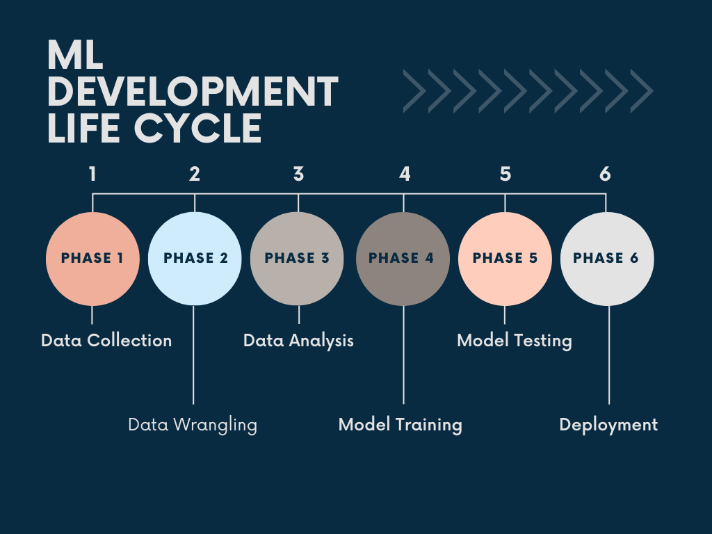

# Gender prediction based on Name LSTM
This ipython notebook is working to build a model which will predict the gender based on the names. 
The dataset used has been taken from:  <a href="https://www.kaggle.com/datasets/shrikrishnaparab/gender-based-names">Kaggle: Gender Based Names</a>  
You can follow the analysis on <a href="https://www.kaggle.com/code/shrikrishnaparab/gender-prediction-based-on-name-using-lstm">kaggle</a>

## Packeges Used:
 ![Python][python] ![TensorFlow][tensor-image] ![scikit-learn][sklearn-image] ![Pandas][Pandas-image] ![Jupyter Notebook][ipython-image] ![Plotly][Plotly-image]
 
[python]: https://img.shields.io/badge/python-3670A0?style=for-the-badge&logo=python&logoColor=ffdd54
[tensor-image]:https://img.shields.io/badge/TensorFlow-%23FF6F00.svg?style=for-the-badge&logo=TensorFlow&logoColor=white
[sklearn-image]:https://img.shields.io/badge/scikit--learn-%23F7931E.svg?style=for-the-badge&logo=scikit-learn&logoColor=white
[Pandas-image]: https://img.shields.io/badge/pandas-%23150458.svg?style=for-the-badge&logo=pandas&logoColor=white
[ipython-image]: https://img.shields.io/badge/jupyter-%23FA0F00.svg?style=for-the-badge&logo=jupyter&logoColor=white
[Plotly-image]: https://img.shields.io/badge/Plotly-%233F4F75.svg?style=for-the-badge&logo=plotly&logoColor=white

## Process:

